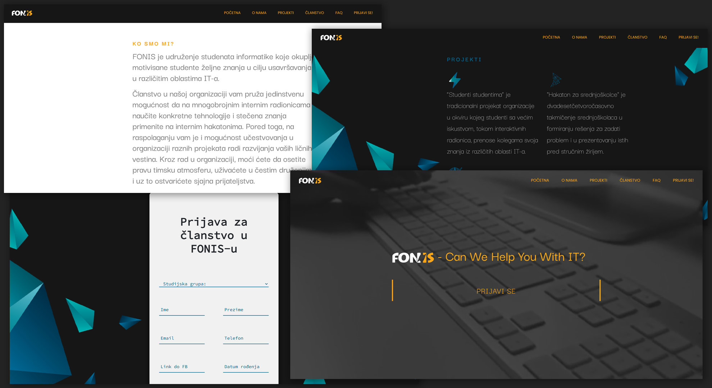

# FONIS Open Day Website - Static Website

> Static website built with the basics of HTML & CSS & Javascript.

This is a web page made for the FONIS organization using JavaScript. The purpose of the web page is promoting the organization to future members.

<!-- toc -->

- [Features](#features)
- [Usage](#usage)

<!-- tocstop -->

## Features

- Sidebar with basic navigation to each section
- Static info separated within several sections
- Modern design
- Ability to apply for membership in a organization via dynamic form

## Usage

- Install Live Server extension
- Start the Live Server

---
